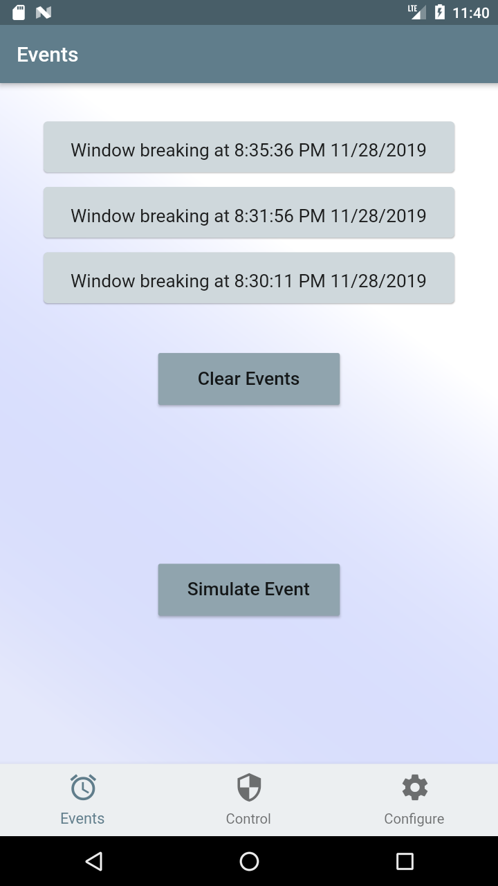
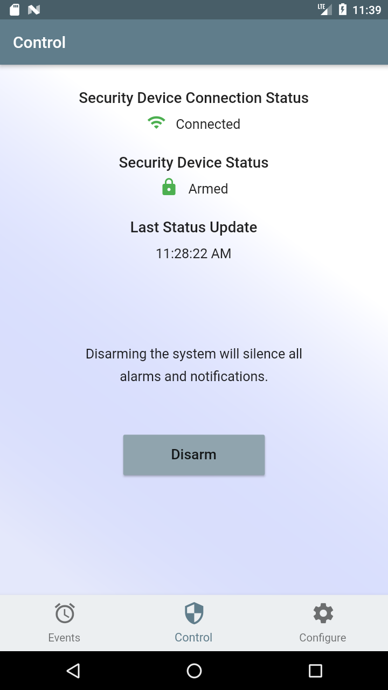
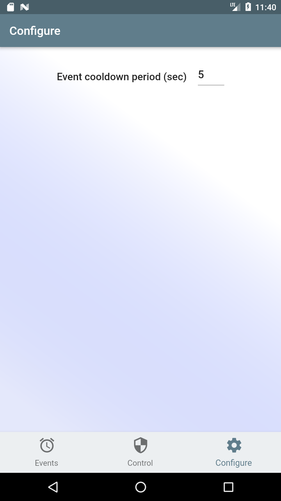

# Safe Sound

The Safe Sound Home Security System leverages machine learning to detect audible intrusion attempts and alert the home owner with a notification on the Safe Sound app. The Microsoft Azure Sphere is used as the basis for the device because of its focus on security. Read more about this project in [this tutorial](https://www.hackster.io/jdpwebb/ai-powered-smart-home-security-2e927c);

    

## How It Works

Audio is continuously collected by the Safe Sound device and classified into various categories using a machine learning model, such as background_noise, window_break, gunshot, etc.. If an audio event indicating a break-in is detected, the device sends a message via Azure Cloud Services to the Safe Sound app. More specifically, the Azure Sphere sends a telemetry message to Azure IoT Hub which triggers an Azure Function that uses the Firebase SDK to transmit a notification. 

The Safe Sound app is built with Flutter and can be used on either an Android or iOS device.

## Safe Sound App

The Safe Sound App allows viewing recent events, arming/disarming the system, and some configuration.

## Setup and Running

See the README files in each sub-project for more detail and instructions on running each part of the project.

### Azure Function

Code found in azure_function.js is intended to run on an Azure Function and is used to send a notification to Firebase which then delivers the notification to the Safe Sound app. To use this, commission a node.js Azure Function, install the Firebase Admin SDK, upload the Firebase service account credentials to the Function, setup the Azure IoT Hub as a trigger, and place the code in the Function.

### Audio Classifier Training Notebook

The Safe_Sound_Audio_Classifier.ipynb is a Python notebook built to run on Google Colab and used to train the machine learning model that runs on the Azure Sphere. Colab has everything needed to run the notebook already installed. Just open the notebook in a browser and explore it.

